# File Management Service

[](https://codecov.io/github/hanieas/fastapi-file-management-service)

## Table of Contents
1. [Introduction](#introduction)
2. [Technology Stack and Features](#technology-stack-and-features)
3. [Why a Separate File Management Service?](#why-a-separate-file-management-service)
4. [How to Use it?](#how-to-use-it)
5. [API Endpoints](#api-endpoints)
6. [Contributing](#Contributing)

## Introduction

This microservice is designed to manage all file-related tasks. It uses **MinIO** for object storage and **MySQL** for managing file metadata. We support chunk uploads for handling large files efficiently, with **Celery** running background tasks to ensure smooth performance.

## Technology Stack and Features

- ⚡ [**FastAPI**](https://fastapi.tiangolo.com) for the Python backend API.
- 🧰 [SQLAlchemy](https://www.sqlalchemy.org/) for the Python SQL database interactions (ORM).
- 🔍 [Pydantic](https://docs.pydantic.dev), used by FastAPI, for the data validation and settings management.
- 🗄️ [MYSQL](https://www.mysql.com/) as the SQL database.
- 🔄 [Alembic](https://alembic.sqlalchemy.org/en/latest) for database migrations.
- 🔧 [Celery](https://docs.celeryq.dev/en/stable/) with [RabbitMQ](https://www.rabbitmq.com/) for task queue management and background processing.
- 💾 [MinIO](https://min.io/) for scalable object storage with chunk upload support.
- ✅ [Pytest](https://pytest.org) for testing to ensure code reliability and functionality.
- 🐋 [Docker Compose](https://www.docker.com) for development and production.
  
## Why a Separate File Management Service?

1. Centralizes file operations, making management and maintenance easier.
2. Enables scaling file handling independently of other services.
3. Simplifies updates and changes to file handling without impacting other parts of the system.
4. Reduces code duplication by keeping file upload and retrieval logic in one place, resulting in cleaner code.

## How to Use it?

1. **Complete the `.env` File**: 
    - Copy the contents of `.env.example` to a new file named `.env`.
    - Fill in the required environment variables based on your setup.

2. **Build the Docker Image**:
    - Run the following command to build the Docker image:
        ```bash
        docker compose build
        ```

3. **Run the Containers**:
    - After the build is complete, start the containers in detached mode with:
        ```bash
        docker compose up -d
        ```

4. **Migrate the Database**:
    - Access the running container to perform the database migration:
        ```bash
        docker compose exec filemanager bash
        ```
    - Inside the container, run the migration using Alembic:
        ```bash
        alembic upgrade head
        ```

5. **Access the Service**:
    - The project is now up and running, accessible on port `8000`.
    - You can access the project documentation by navigating to `/docs` on your browser.

## API Endpoints

Here’s a quick reference guide to the available API endpoints, their methods, and what they do:

| Method | URL                                         | Description                                                      |
|--------|---------------------------------------------|------------------------------------------------------------------|
| POST   | `/api/v1/file/upload/init/`                 | Initialize a new file upload session.                            |
| POST   | `/api/v1/file/upload/chunk/`                | Upload a file chunk.                                             |
| POST   | `/api/v1/file/upload/complete/`             | Complete the file upload process.                                |
| GET    | `/api/v1/file/get/{file_id}`                | Retrieve a file by its ID.                                       |
| GET    | `/api/v1/file/status/{file_id}`             | Check the upload status of a file.                               |
| POST   | `/api/v1/file/upload/retry`                 | Retry uploading a file.                                          |

A Postman collection export is also available for testing these endpoints. You can import it into Postman to quickly get started with API testing.

## Contributing

We welcome contributions from everyone! If you have ideas for improvements, new features, or bug fixes, feel free to contribute to this project. Here's how you can get involved:

1. **Create an Issue**: 
    - If you find a bug, have a question, or want to suggest a feature, please open an issue. This helps us track and discuss your ideas.

2. **Send a Pull Request (PR)**:
    - Fork the repository, make your changes in a new branch, and then create a pull request. 
    - Please make sure your code follows the project's coding standards and passes all tests.

We appreciate your contributions and will do our best to review and merge your pull requests promptly. Thank you for helping us improve this project!

Frontend:

## Frontend
This is a [Next.js](https://nextjs.org) project bootstrapped with [`create-next-app`](https://nextjs.org/docs/app/api-reference/cli/create-next-app).


After running the Docker Containers, simply start the frontend using the following command. We have implemented CORS for backend integration.

```bash
npm run dev
# or
yarn dev
# or
pnpm dev
# or
bun dev
```

Open [http://localhost:3000](http://localhost:3000) with your browser to see the result.

# File Management System Architecture

## Clean Architecture with DTO Pattern

```mermaid
graph TD
    A["FRONTEND<br/>React/Next.js<br/>User Interface • HTTP Requests • State Management"] --> |"HTTP/JSON"| B["API ROUTES<br/>FastAPI Endpoints<br/>Route Handlers • Request/Response DTOs • HTTP Validation"]
    B --> |"DTOs"| C["HANDLERS<br/>Business Coordination<br/>Logic Coordination • DTO Transformations • Error Handling"]
    C --> |"DTOs"| D["SERVICES<br/>Core Business Logic<br/>Business Rules • External Integrations • MinIO & Celery"]
    D --> |"Entities/DTOs"| E["REPOSITORIES<br/>Data Access Layer<br/>Database Operations • Entity Conversion • Query Logic"]
    E --> |"SQL/ORM"| F["DATABASE<br/>MySQL Storage<br/>Persistent Storage • Entity Models • Foreign Key Relations"]

    %% Styling for each layer
    classDef frontend fill:#667EEA,stroke:#fff,stroke-width:3px,color:#fff,font-weight:bold
    classDef api fill:#48BB78,stroke:#fff,stroke-width:3px,color:#fff,font-weight:bold
    classDef handlers fill:#ED8936,stroke:#fff,stroke-width:3px,color:#fff,font-weight:bold
    classDef services fill:#9F7AEA,stroke:#fff,stroke-width:3px,color:#fff,font-weight:bold
    classDef repositories fill:#38B2AC,stroke:#fff,stroke-width:3px,color:#fff,font-weight:bold
    classDef database fill:#4A5568,stroke:#fff,stroke-width:3px,color:#fff,font-weight:bold

    %% Apply styles to nodes
    class A frontend
    class B api
    class C handlers
    class D services
    class E repositories
    class F database

    %% Add title and subtitle as subgraph
    subgraph Title ["File Management System Architecture - Clean Architecture with DTO Pattern"]
        direction TB
        G[" "]
    end
    
    %% Style the title subgraph
    classDef titleStyle fill:#F7FAFC,stroke:#2D3748,stroke-width:2px,color:#2D3748,font-weight:bold
    class Title titleStyle
    
    %% Hide the placeholder node
    classDef hidden fill:transparent,stroke:transparent,color:transparent
    class G hidden
```



## Key Architecture Principles

- **DTOs**: Data validation & transformation between layers
- **Clean separation of concerns**: Each layer has specific responsibilities  
- **Security through controlled data flow**: Input validation and controlled exposure
- **Scalable layered architecture**: Easy to maintain and extend

## Layer Responsibilities

### Frontend (React/Next.js)
- User interface components
- HTTP request handling
- Client-side state management

### API Routes (FastAPI)
- HTTP endpoint definitions
- Request/Response DTOs
- Input validation and serialization

### Handlers
- Business logic coordination
- DTO transformations between layers
- Error handling and response formatting

### Services
- Core business logic implementation
- External service integrations (MinIO, Celery)
- Business rule enforcement

### Repositories
- Database operations and queries
- Entity to DTO conversion
- Data access abstraction

### Database (MySQL)
- Persistent data storage
- Entity models with SQLAlchemy
- Foreign key relationships and constraints

---

# 📄 File Upload Process - Detailed Flow

## 🎯 Overview
The file management system uses a **chunked upload strategy** with background processing to handle large files efficiently. Here's the complete flow through all architectural layers:

## 📊 Complete Upload Flow Diagram


## 🌐 Layer-by-Layer Breakdown

### 1. **Frontend Layer (React/Next.js)**
**Three-Phase Upload Process:**

#### Phase 1: Upload Initialization
```typescript
// POST /api/v1/file/upload/init/
const initResponse = await fetch(`${API_BASE_URL}/upload/init/`, { method: 'POST' });
const { chunk_size, upload_id } = initResponse.data;
```
- **Purpose**: Get upload configuration and unique upload ID
- **Data Received**: `chunk_size`, `upload_id`

#### Phase 2: Chunked Upload
```typescript
const totalChunks = Math.ceil(file.size / chunk_size);
for (let i = 0; i < totalChunks; i++) {
  const chunk = file.slice(start, end);
  // POST /api/v1/file/upload/chunk/ for each chunk
}
```
- **Purpose**: Upload file in small chunks for large file handling
- **Progress Tracking**: Updates progress bar after each chunk

#### Phase 3: Upload Completion
```typescript
// POST /api/v1/file/upload/complete/
// Sends: upload metadata, appointment/user associations, file details
// Receives: File record with download URL
```

### 2. **API Routes Layer (FastAPI)**
**Route Definitions & Validation:**
- **`/upload/init/`**: Initialize upload session
- **`/upload/chunk/`**: Validate and receive chunks (size ≤ max chunk size)
- **`/upload/complete/`**: Finalize upload with comprehensive validation

### 3. **Handlers Layer (Business Coordination)**
**DTO Transformations:**
- **Input**: Form data → `UploadChunkDTO`, `UploadFileDTO`
- **Output**: `File` entity → `FileResponse`
- **Error Handling**: Service exceptions → HTTP status codes

### 4. **Services Layer (Core Business Logic)**
**Key Operations:**
- **Upload Initialize**: Create UUID, temporary directory
- **Upload Chunk**: Async file I/O, chunk validation
- **Upload Complete**: 
  - ✅ **Idempotency check** (prevents duplicates)
  - 🔒 **Security**: Public vs private bucket determination
  - ⚡ **Background Processing**: Celery task creation

### 5. **Repository Layer (Data Access)**
**Database Operations:**
- **DTO → Entity Conversion**: `FileBaseDTO` → `File` entity
- **Relationships**: Links to `appointments` and `users` tables
- **Transaction Management**: Commit/rollback handling

### 6. **Database Layer (MySQL Storage)**
**File Entity Structure:**
- 🟡 **Primary Key**: `id` (UUID)
- 🟢 **Unique Index**: `upload_id` (prevents duplicates)
- 🔴 **Foreign Keys**: `appointment_id`, `user_id`
- **JSON Columns**: `credential`, `detail` (flexible metadata)

### 7. **Background Processing (Celery Task)**
**Asynchronous File Assembly:**
1. **Assembly**: Combine all chunks in sequential order
2. **Storage**: Upload complete file to MinIO object storage
3. **Cleanup**: Remove temporary files and directories

## 🔑 Key Benefits

- **🔄 Idempotency**: `upload_id` prevents duplicate uploads
- **📦 Chunked Upload**: Handles large files and network interruptions
- **⚡ Async Processing**: Non-blocking API with background tasks
- **🔒 Security**: Public/private bucket determination
- **🎯 Clean Separation**: Each layer has specific responsibilities
- **📊 Comprehensive Logging**: Full traceability across layers
- **🛡️ Error Handling**: Graceful failure handling at each layer

This architecture ensures reliable, scalable, and maintainable file upload processing!

